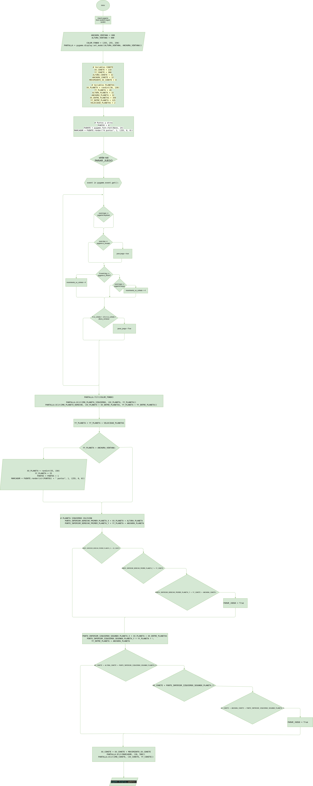

# bimestral_1
bimestral

# Explicación del Código en Pygame

## Introducción
Este código implementa un sencillo juego en Pygame donde un cohete se desplaza horizontalmente y debe evitar colisiones con planetas que descienden desde la parte superior de la pantalla.

## Librerías Importadas
```python
import pygame
from random import randint
```
- `pygame`: Librería para crear juegos y gráficos interactivos.
- `randint`: Función de la librería `random` para generar valores aleatorios.

## Inicialización de Pygame
```python
pygame.init()
```
Se inicializa Pygame antes de utilizar sus funciones.

## Configuración de la Ventana
```python
ANCHURA_VENTANA = 600
ALTURA_VENTANA = 600
COLOR_FONDO = (255, 255, 250)
PANTALLA = pygame.display.set_mode((ALTURA_VENTANA, ANCHURA_VENTANA))
```
- Se define el tamaño de la ventana.
- Se establece un color de fondo (blanco marfil).
- Se crea la ventana del juego.

## Variables del Juego
### Variables del Cohete
```python
XX_COHETE = 210
YY_COHETE = 300
ALTURA_COHETE = 32
ANCHURA_COHETE = 32
MOVIMIENTO_XX_COHETE = 0
```
- Se establece la posición inicial del cohete.
- Se definen sus dimensiones y su movimiento en el eje `x`.

### Variables de los Planetas
```python
XX_PLANETA = randint(30, 130)
YY_PLANETA = 20
ALTURA_PLANETA = 32
ANCHURA_PLANETA = 32
XX_ENTRE_PLANETAS = 350
YY_ENTRE_PLANETA = 125
VELOCIDAD_PLANETAS = 2
```
- Se inicializan las coordenadas de los planetas.
- Se define la distancia entre los dos planetas que aparecen en pantalla.
- Se establece la velocidad con la que caen.

### Puntos y Fuente de Texto
```python
PUNTOS = 0
FUENTE = pygame.font.Font(None, 24)
MARCADOR = FUENTE.render("0 puntos", 1, (255, 0, 0))
```
- Se inicializa el puntaje del jugador.
- Se define la fuente del texto que muestra los puntos.
- Se renderiza el marcador de puntos en color rojo.

### Carga de Imágenes
```python
IMG_COHETE = pygame.image.load("img/COHETE.png")
IMG_PLANETA_IZQUIERDO = pygame.image.load("img/PLANETA.png")
IMG_PLANETA_DERECHO = pygame.image.load("img/PLANETA.png")
```
- Se cargan las imágenes del cohete y los planetas.

## Bucle Principal del Juego
```python
while not PARAR_JUEGO:
```
Este bucle mantiene el juego en ejecución hasta que el jugador lo detenga.

### Eventos del Juego
```python
for event in pygame.event.get():
    if event.type == pygame.QUIT:
        PARAR_JUEGO = True
    if event.type == pygame.KEYDOWN:
        if event.key == pygame.K_ESCAPE:
            PARAR_JUEGO = True
        if event.key == pygame.K_RIGHT:
            MOVIMIENTO_XX_COHETE = 4
    elif event.type == pygame.KEYUP:
        MOVIMIENTO_XX_COHETE = -4
```
- Se detecta si el jugador cierra la ventana.
- Se permite mover el cohete hacia la derecha con la flecha derecha.
- Si se suelta la tecla, se cambia el movimiento.

### Lógica de Colisiones y Movimiento de Objetos
```python
if XX_COHETE < -10 or XX_COHETE > ALTURA_VENTANA:
    PARAR_JUEGO = True
```
- Si el cohete sale de los límites de la pantalla, el juego termina.

```python
PANTALLA.fill(COLOR_FONDO)
PANTALLA.blit(IMG_PLANETA_IZQUIERDO, (XX_PLANETA, YY_PLANETA))
PANTALLA.blit(IMG_PLANETA_DERECHO, (XX_PLANETA + XX_ENTRE_PLANETAS, YY_PLANETA + YY_ENTRE_PLANETA))
YY_PLANETA = YY_PLANETA + VELOCIDAD_PLANETAS
```
- Se limpia la pantalla y se dibujan los planetas en nuevas posiciones mientras descienden.

```python
if YY_PLANETA > ANCHURA_VENTANA:
    XX_PLANETA = randint(55, 150)
    YY_PLANETA = 25
    PUNTOS = PUNTOS + 1
    MARCADOR = FUENTE.render(str(PUNTOS) + " puntos", 1, (255, 0, 0))
```
- Si los planetas llegan al fondo, se reinician en una nueva posición aleatoria y se aumenta la puntuación.

### Detección de Colisiones
#### Planeta Izquierdo
```python
PUNTO_INFERIOR_DERECHO_PRIMER_PLANETA_X = XX_PLANETA + ALTURA_PLANETA
PUNTO_INFERIOR_DERECHO_PRIMER_PLANETA_Y = YY_PLANETA + ANCHURA_PLANETA
if PUNTO_INFERIOR_DERECHO_PRIMER_PLANETA_X > XX_COHETE:
    if PUNTO_INFERIOR_DERECHO_PRIMER_PLANETA_Y > YY_COHETE:
        if PUNTO_INFERIOR_DERECHO_PRIMER_PLANETA_Y < YY_COHETE + ANCHURA_COHETE:
            PARAR_JUEGO = True
```
- Se verifica si el cohete colisiona con el planeta izquierdo.

#### Planeta Derecho
```python
PUNTO_INFERIOR_IZQUIERDO_SEGUNDO_PLANETA_X = XX_PLANETA + XX_ENTRE_PLANETAS
PUNTO_INFERIOR_IZQUIERDO_SEGUNDO_PLANETA_Y = YY_PLANETA + YY_ENTRE_PLANETA + ANCHURA_PLANETA
if XX_COHETE + ALTURA_COHETE > PUNTO_INFERIOR_IZQUIERDO_SEGUNDO_PLANETA_X:
    if XX_COHETE < PUNTO_INFERIOR_IZQUIERDO_SEGUNDO_PLANETA_Y:
        if XX_COHETE + ANCHURA_COHETE > PUNTO_INFERIOR_IZQUIERDO_SEGUNDO_PLANETA_Y:
            PARAR_JUEGO = True
```
- Se verifica si el cohete colisiona con el planeta derecho.

### Actualización de la Posición del Cohete y Renderizado Final
```python
XX_COHETE = XX_COHETE + MOVIMIENTO_XX_COHETE
PANTALLA.blit(MARCADOR, (20, 580))
PANTALLA.blit(IMG_COHETE, (XX_COHETE, YY_COHETE))
pygame.display.update()
```
- Se actualiza la posición del cohete.
- Se muestra el marcador de puntos.
- Se dibuja el cohete en su nueva posición.
- Se actualiza la pantalla del juego.

## Conclusión
Este código implementa un juego básico en Pygame con mecánicas simples de movimiento y colisión. Se puede mejorar añadiendo sonidos, niveles de dificultad o mecánicas adicionales.




